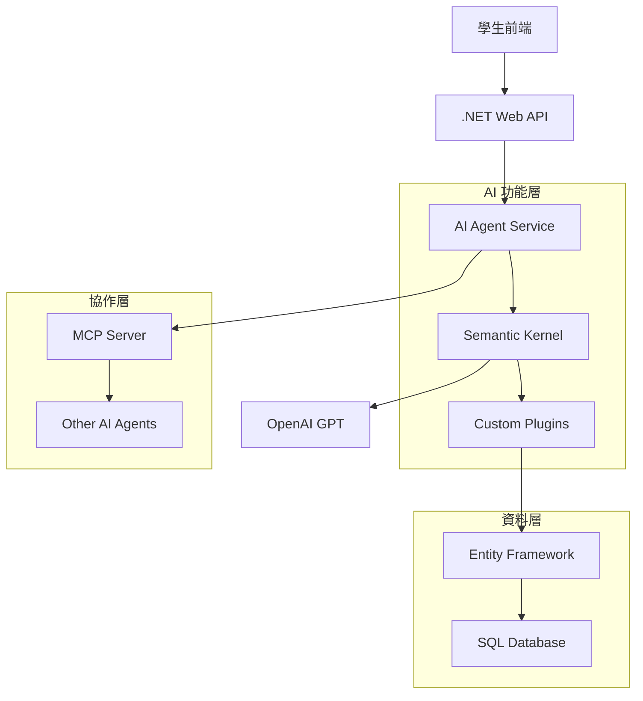

# 🎓 智慧補習班 AI 協作助理系統

[](https://dotnet.microsoft.com/)
[](https://github.com/microsoft/semantic-kernel)
[](https://opensource.org/licenses/MIT)
[](#-快速體驗)

一個結合 **.NET + Semantic Kernel + Microsoft Copilot Platform (MCP)** 的智慧協作 AI Agents 解決方案，將 AI 從單純問答提升為能執行任務、與系統互動、記憶上下文的智慧夥伴。

## 🚀 快速體驗

### 一鍵啟動 Web 版本
```bash
git clone https://github.com/your-username/MyFirstSKApp.git
cd MyFirstSKApp
dotnet run
```
然後開啟瀏覽器訪問 **http://localhost:5000**

### 🌐 線上展示
- **主頁面**: [http://localhost:5000](http://localhost:5000)
- **API 文件**: [http://localhost:5000/swagger](http://localhost:5000/swagger)
- **互動式 AI 助理**: 直接在網頁上與 AI 對話

## 🌟 專案特色

### 🤖 智慧協作 AI Agent
- **個人化對話**：基於 Semantic Kernel 的智慧助理，理解學生需求
- **長期記憶**：維護 ChatHistory，提供連續性對話體驗
- **任務執行**：不只回答問題，更能主動查詢資料、執行功能
- **上下文理解**：結合學生資料與課程資訊，提供精準建議

### 🔧 MCP (Model Context Protocol) 整合
- **多 Agent 協作**：支援課程助理、作業批改、購課查詢等專業 Agent
- **標準化協定**：遵循 JSON-RPC 2.0，易於與其他系統整合
- **企業級部署**：支援企業環境的 AI Agent 管理和協作

### 📚 補習班場景應用
- **學生管理**：個人資料、選課記錄、學習軌跡
- **作業系統**：智慧分析、自動回饋、進度追蹤
- **課程推薦**：根據年級、興趣、學習狀況個人化推薦
- **學習指導**：每日建議、複習提醒、學習方法指引

## 🏗️ 系統架構



## 🚀 核心功能

### 1. 智慧對話系統
```csharp
// 學生與 AI 助理對話
var response = await aiAgentService.ProcessStudentQueryAsync(
    "張小明", 
    "我的數學作業有錯在哪裡？");
```

### 2. 作業智慧分析
```csharp
// AI 分析作業並提供回饋
var feedback = await aiAgentService.AnalyzeHomeworkAsync(
    "張小明", 
    "三角函數應用", 
    "學生提交的作業內容");
```

### 3. MCP 工具調用
```csharp
// 透過 MCP 協定調用工具
var result = await mcpServer.HandleToolCallAsync(new MCPToolCallRequest
{
    name = "query_student_homework",
    arguments = new Dictionary<string, object>
    {
        ["student_name"] = "張小明"
    }
});
```

### 4. 個人化推薦
```csharp
// 根據學生狀況推薦課程
var recommendation = await aiAgentService.GenerateDailyRecommendationAsync("張小明");
```

## 🛠️ 技術棧

### 後端技術
- **.NET 8.0**：現代化 C# 開發框架
- **ASP.NET Core**：高效能 Web API
- **Entity Framework Core**：ORM 資料存取
- **Semantic Kernel 1.65.x**：Microsoft AI 協作框架

### AI 技術
- **OpenAI GPT-4**：強大的語言理解和生成
- **Function Calling**：AI 主動調用系統功能
- **Custom Plugins**：客製化業務邏輯整合
- **Memory Management**：對話歷史和上下文管理

### 協作協定
- **MCP (Model Context Protocol)**：標準化 AI Agent 通訊
- **JSON-RPC 2.0**：輕量級遠端程序呼叫
- **RESTful API**：標準 HTTP API 介面

### 前端技術
- **HTML5/CSS3/JavaScript**：現代網頁技術
- **響應式設計**：適配各種裝置螢幕
- **互動式 UI**：流暢的使用者體驗

## 📦 專案結構

```
MyFirstSKApp/
├── Controllers/          # Web API 控制器
├── Data/                 # 資料庫上下文和模型
├── MCP/                  # MCP 協定實作
├── Models/               # 資料模型
├── Plugins/              # Semantic Kernel 插件
├── Services/             # 業務邏輯服務
├── wwwroot/              # 靜態網頁檔案
├── Program.cs            # 應用程式進入點
├── appsettings.json      # 組態設定
└── README.md             # 專案說明
```

## ⚙️ 設定和安裝

### 1. 環境需求
- .NET 8.0 SDK
- Visual Studio 2022 或 VS Code
- OpenAI API Key（可選，有模擬模式）

### 2. 複製專案
```bash
git clone https://github.com/your-repo/MyFirstSKApp.git
cd MyFirstSKApp
```

### 3. 設定 API Key
編輯 `appsettings.json`：
```json
{
  "OpenAI": {
    "ApiKey": "your-actual-openai-api-key",
    "Model": "gpt-4-turbo-preview"
  }
}
```

### 4. 安裝套件和執行
```bash
dotnet restore
dotnet build
dotnet run
```

### 5. 開啟網頁介面
瀏覽器開啟：`http://localhost:5000/index.html`

## 🎯 使用範例

### 學生詢問作業狀況
```
學生：「我的數學作業有什麼需要注意的地方？」

AI 回應：
我已經查詢了您的作業狀況。根據記錄：

📚 二次函數練習 - 已評分 (85分)
老師回饋：計算正確，但要注意圖形標示

📚 三角函數應用 - 已繳交，等待評分
您提到第6題需要協助，建議複習三角函數基本性質

🎯 學習建議：
• 加強圖形標示的準確性
• 多練習類似的應用題
• 如有疑問歡迎隨時詢問
```

### 課程推薦
```
學生：「有適合國三的數學課程嗎？」

AI 回應：
根據您的年級，為您推薦：

📖 國三數學總復習
👨‍🏫 授課老師：陳老師
💰 學費：$12,000
📅 開課日期：2025/01/15
📍 剩餘名額：5 名

這門課程針對會考重點，很適合您的程度！
```

## 🔧 MCP 工具列表

| 工具名稱 | 功能描述 |
|---------|---------|
| `query_student_homework` | 查詢學生作業狀況、成績和回饋 |
| `get_student_profile` | 取得學生基本資料和選課狀況 |
| `list_courses` | 列出可選修課程，支援科目篩選 |
| `recommend_courses` | 根據年級和興趣推薦課程 |
| `chat_with_student` | 智慧對話和個人化指導 |
| `analyze_homework` | 作業分析和 AI 回饋 |

## 📊 專案亮點

### 1. 🧠 智慧記憶管理
- **短期記憶**：單次對話的上下文理解
- **長期記憶**：學生歷史互動和學習軌跡
- **個人化體驗**：基於記憶提供客製化服務

### 2. 🔄 自動化工作流程
```
學生提問 → AI 理解意圖 → 調用相關 Plugin → 查詢資料 → 生成回應 → 記錄互動
```

### 3. 🎯 多 Agent 協作範例
- **課程助理 Agent**：專門處理課程查詢和推薦
- **作業批改 Agent**：專精於作業分析和回饋
- **購課查詢 Agent**：負責選課和付費流程

### 4. 📈 可擴展架構
- **Plugin 系統**：輕鬆新增業務功能
- **MCP 整合**：標準化 Agent 間通訊
- **API 導向**：支援多種前端技術整合

## 🚀 部署選項

### 開發環境
```bash
dotnet run --urls="http://localhost:5000"
```

### 生產環境
```bash
dotnet publish -c Release
# 部署到 IIS、Azure App Service 或 Docker
```

### Docker 容器化
```dockerfile
FROM mcr.microsoft.com/dotnet/aspnet:8.0
COPY . /app
WORKDIR /app
EXPOSE 80
ENTRYPOINT ["dotnet", "MyFirstSKApp.dll"]
```

## 🛣️ 未來擴展

### 1. 前端框架整合
- **React**：現代化 SPA 應用
- **Blazor**：.NET 全棧開發
- **Mobile App**：React Native 或 .NET MAUI

### 2. 進階 AI 功能
- **語音互動**：整合 Azure Speech Services
- **圖片辨識**：作業圖片自動分析
- **多語言支援**：國際化學習平台

### 3. 企業級功能
- **SSO 整合**：企業身份認證
- **角色權限**：多層級使用者管理
- **審計日誌**：完整的操作記錄

### 4. AI 能力提升
- **RAG 整合**：結合知識庫的精準回答
- **Fine-tuning**：針對教育場景優化模型
- **Multi-modal**：支援文字、圖片、語音多模態

## 📞 技術支援

如有問題或建議，歡迎聯繫：
- 📧 Email: support@example.com
- 💬 GitHub Issues
- 📚 Documentation: [連結]

---

## 🤝 貢獻指南

歡迎提交 Pull Request 或開啟 Issue！

1. Fork 專案
2. 建立功能分支 (`git checkout -b feature/AmazingFeature`)
3. 提交變更 (`git commit -m 'Add some AmazingFeature'`)
4. 推送分支 (`git push origin feature/AmazingFeature`)
5. 開啟 Pull Request

## 📄 授權條款

本專案採用 MIT 授權條款 - 詳見 [LICENSE](LICENSE) 檔案

---

**🎓 讓 AI 成為教育的智慧夥伴，而不只是問答工具！**